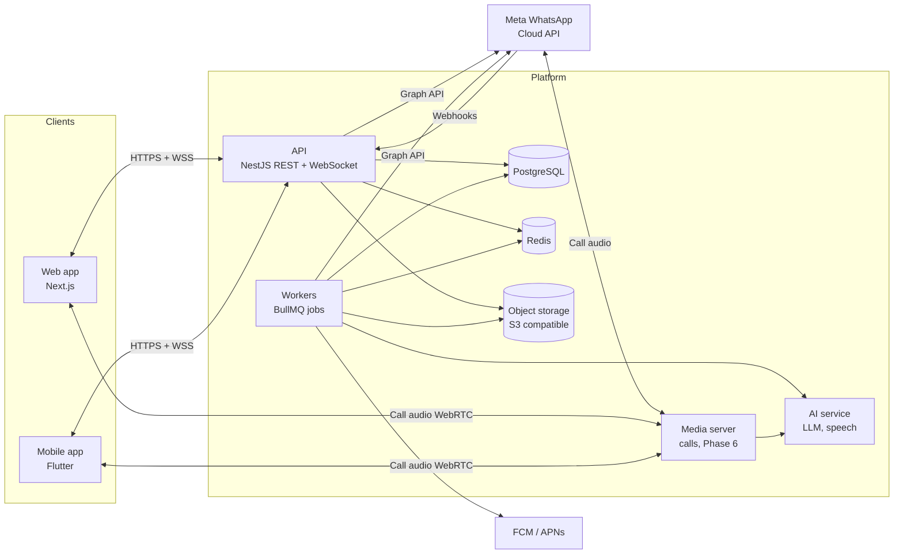

# 01 · Architecture

## The product in one paragraph

Smart Reply is sold to many companies. Each company connects its own WhatsApp Business
number. A manager and up to 100 staff answer that number's chats and calls from a web
dashboard and a mobile app. LUMI AI, as the platform owner, creates and manages the
companies from a system admin console.

## Roles

| Role | Who | Scope | Where they work |
|---|---|---|---|
| `system_admin` | LUMI AI (the seller) | Every company | Web: `/admin` |
| `manager` | The customer's owner or supervisor | One company, everything in it | Web and mobile |
| `staff` | The customer's employees | One company, only customers assigned to them unless the manager grants more | Web and mobile |

Rules that follow from this:

- A `system_admin` creates a company and its first manager. A system admin never adds staff.
- Only a `manager` adds or removes staff. The seat limit comes from the company's plan and is
  never more than 100.
- A `staff` member sees only conversations and calls for contacts they own, plus the team
  pool, unless the manager turns on "see chats assigned to others".
- Every row of business data belongs to exactly one company. No query may run without a
  company filter, except in the system admin area.

The permission matrix shown on the Roles screen is the source of truth for what staff can
do. It is stored per company so a manager can change it.

| Capability | Manager | Staff (default) |
|---|---|---|
| Reply to assigned chats and calls | Yes | Yes |
| See every chat | Yes | No |
| Assign and transfer chats | Yes | Transfer own, release to team, take from pool |
| Send approved templates | Yes | Yes |
| Create templates and broadcasts | Yes | No |
| Catalog and pricing | Edit | View |
| Reports, billing, settings | Yes | Own performance only |
| Add or remove staff | Yes | No |
| Quick replies | Add, edit, remove | Add, edit, remove own; use shared |
| AI bot and automated flows | Yes | No |

## System diagram



## Components

| Component | Technology | Job |
|---|---|---|
| Web app | The existing Next.js app in `frontend/` | All Manager, Staff and System admin screens |
| API | NestJS, TypeScript, in `backend/` | Authentication, permissions, REST endpoints, WebSocket gateway, Meta webhook receiver |
| Workers | BullMQ on Redis, same codebase as the API, separate process | Webhook processing, sending messages, media download and upload, broadcasts, template sync, reports, push notifications, AI replies |
| Database | PostgreSQL 16, Prisma for migrations and queries | All business data |
| Cache and queue | Redis 7 | Job queues, presence, rate limits, WebSocket fan-out |
| Object storage | Any S3-compatible store (MinIO on the VPS to start) | Chat media, gallery, call recordings, exports |
| Media server | Decided by the Phase 6 proof of concept | Bridges Meta's call audio to agents; recording, IVR, queue, transfer, conference |
| AI service | A provider behind an internal interface | Chat auto-reply, call transcript and summary, voice bot |
| Mobile app | Flutter, in `mobile/` | Staff and manager on Android and iOS |

## Repository layout

```
/
  AGENTS.md            rules for coding agents
  docs/plan/           this plan
  frontend/            Next.js web app (exists)
  backend/             NestJS API and workers
  mobile/              Flutter app
  packages/shared/     TypeScript types and validation schemas used by frontend and backend
  infra/               docker-compose files, reverse proxy config, backup scripts
```

Use npm workspaces at the root so `frontend`, `backend` and `packages/shared` share one
lockfile.

## Why the work goes through queues

Meta retries a webhook for up to 7 days if the endpoint does not answer with HTTP 200, and
it can send the same event more than once. So the webhook endpoint does three things only:
check the signature, store the raw event, put a job on the queue. It then answers 200.
A worker does the real processing. Each event has a unique key, so processing it twice
changes nothing.

Outgoing messages take the same path in reverse. The API writes the message with status
`queued` and returns at once; a worker calls Meta and updates the status. The user sees the
bubble immediately and its ticks change when Meta reports back.

## Tenant isolation

1. Every business table has a `company_id` column, not null, indexed.
2. The API takes `company_id` from the signed-in user's session. It is never read from the
   request body or URL.
3. All database access goes through a repository layer that adds the company filter. A raw
   query without it fails code review and a lint rule.
4. PostgreSQL row-level security is turned on in Phase 9 as a second lock.
5. Object storage keys start with the company id. Download links are short-lived signed URLs.
6. WebSocket rooms are named by company and by user. A socket joins only rooms derived from
   its own session.
7. An automated test logs in as company A and requests every endpoint with ids that belong
   to company B. Every response must be 404.

## Authentication and sessions

- Email and password. Passwords hashed with Argon2id.
- A short-lived access token (15 minutes) and a rotating refresh token (30 days). On the web
  both live in `httpOnly`, `Secure`, `SameSite=Lax` cookies. The mobile app keeps the refresh
  token in the device's secure storage.
- Staff join by invitation: the manager enters a name and email or phone, the person
  receives a link, sets a password, and the seat is taken.
- Password reset by emailed link. Optional two-step login for managers and system admins
  in Phase 9.
- A system admin can "open a company as manager" for support. That session is marked as
  impersonation, shown with a banner, and written to the audit log.
- Rate limits on login, reset and invite endpoints.

## Real time

One WebSocket connection per signed-in client (Socket.IO). The server pushes events; the
client never polls. The event list is in [03-api-contract.md](03-api-contract.md).
If the socket drops, the client reconnects and refetches the lists it has open.

## Security baseline

- HTTPS everywhere. HSTS on the web domain.
- Meta access tokens and other secrets encrypted at rest with a key held outside the database.
- Every webhook request verified with Meta's signature header before it is stored.
- Input validated on the server with the shared schemas. The front end's checks are for
  convenience only.
- File uploads: type sniffed from content, size capped to WhatsApp's limits, stored outside
  the web root, served by signed URL.
- Audit log for every change to staff, permissions, ownership, templates, settings, billing
  and every impersonation.
- No customer message text in application logs.
- Dependency and container scanning in CI.

## Non-functional targets for the first release

| Target | Value |
|---|---|
| Companies | 50 |
| Staff online at once | 500 |
| Incoming message to on-screen | under 2 seconds at the 95th percentile |
| Webhook acknowledgement | under 1 second |
| Availability | 99.5% monthly |
| Backups | Database nightly plus continuous log archiving; restore tested monthly |
| Data kept | Messages and recordings per the company's retention setting (default 90 days for recordings, as the Call settings screen shows) |

These are planning targets, not measurements. Phase 9 load tests check them.
